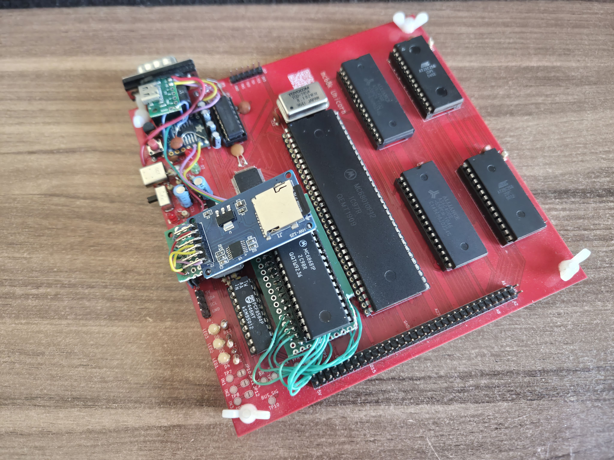
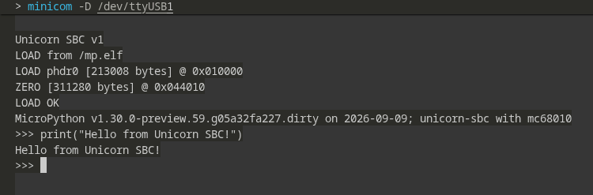

# Unicorn - a mc68k-based SBC

This SBC was created with one goal in mind - to run UNIX or UNIX-like OS on it. In order to achieve this, the Motorola 68010 had to be chosen since it's the first mc68k family member to support virtual memory (at least in the basic form) and is able to cooperate with a MMU natively.

## Hardware V1

### V1 description

The board is designed in KiCad. The main specs are:

- Motorola 68010 CPU @ 8.192Mhz
- 1MB of SRAM in the form of 2x AS6C4008 (512k x 8) modules
- 64kB of ROM in the form of 2x AT28C256 (32k x 8) modules
- Xilinx xc9572xl CPLD used as glue logic and simple PMMU
- Motorola MC68681 DUART chip for IO
- PCF8584P I2C controller

The board uses two voltage rails, 5V and 3V3, with the latter being used to power the CPLD only and the rest of the system being powered from the 5V. The 3V3 regulator derives its voltage from the 5V rail which is supplied via the USB-C plug which also doubles as the UART1 (`Serial A`) input/output. The board has a DB9 socket which is connected via MAX232 to the 68681 DUART on UART2 (`Serial B`). Additionally, there is a JTAG header for programming the CPLD and two headers for I2C and SPI. 3 programmable LEDs and 3 inputs are available to the user.

#### Memory map

The memory map is defined by the CPLD and is kept as simple as possible:

|Address range|Size [bytes]|Contents|
|---|---|---|
|0x000000 - 0x00FFFF|64k|ROM|
|0x010000 - 0x1FFFFF|1M|SRAM|
|0x110000 - 0x1100FF|256|68681 DUART|
|0x110100 - 0x1101FF|256|8584P I2C|

### V1 conclusions

The board needed a few small adjustments but otherwise functions correctly. Its main problems are very slow SPI bus (bit-banged) and not enough pins on the CPLD to connect all necessary signals for it to function as the PMMU.

## Hardware V2

Changes scheduled for the hardware revision 2:

- Add clock divider circuit to allow for different clocks to be derived and used throughout the system
- Add hardware solution to the SPI - either inside the CPLD or as a separate circuit
- [Optional] Remove the I2C circuit since bit-banged I2C should be sufficient
- Add an RTC on the I2C bus
- Add the SD card slot directly to the board
- Move to the 100 pin version of the CPLD to accomodate all signals
- General layout fixes - USB, DUART data lines etc.

### Further changes

A DRAM controller and a SIMM socket(s) would allow this SBC to address even more memory, up to 68010's 16MB natively and even more through paging. This would require adding a second CPLD or even swapping the current CPLD with a FPGA. While this is not required to reach the goal of running UNIX, it would significantly expand the SBC's capabilities.

## Software

### Firmware description

The board can run any software compiled with the `m68k-elf-gcc` or equivalent m68k compiler. It can utilize its own fork of [`picolibc`](https://github.com/lokuciejewski/picolibc-unicorn) which implements some of the stdlib's functions. The supplied [bootloader](./software/firmware/) allows loading any `.elf` file from the SD card and running it. The bootloader comes with a small monitor - a customized [`tinylisp`](https://github.com/Robert-van-Engelen/tinylisp) implementation.

The bootloader mounts the SD card (FAT16-formatted) and searches for the file named `bootord`. It then tries to load a file that's in the `bootord` into the memory at address `0x10000`. After that, it tries to execute the executable.

### Architecture-specific design decisions

Motorola 68010, unlike the 68000 allows for relocating the interrupt vector table into an arbitrary address in its memory space. The Unicorn SBC's bootloader allocates the interrupt vector table at the top of its base 1M of SRAM, at address `0x10FC00`. This 1KB is reserved by the system and must never be accessed by the application directly.

### Compiling the software

#### Requirements

- [`m68k-elf-gcc`](https://github.com/kentosama/m68k-elf-gcc) compiler or any other C compiler that supports the m68k architecture. With a bit of fiddling, the newer GCC can be built, I used `gcc-16.2.0` with the following configuration options: `--prefix=/tmp/m68k-elf-gcc/m68k-toolchain --build=x86_64-pc-linux-gnu --host=x86_64-pc-linux-gnu --target=m68k-elf --program-prefix=m68k-elf- --enable-languages=c --enable-obsolete --enable-lto --disable-threads --disable-libmudflap --disable-libgomp --disable-nls --disable-werror --disable-libssp --disable-shared --disable-multilib --disable-libgcj --disable-libstdcxx --disable-gcov --without-headers --without-included-gettext --with-cpu=m68010 --with-newlib`
- [A fork of `picolibc`](https://github.com/lokuciejewski/picolibc-unicorn) which needs to be installed into the above toolchain
- An SD card formatted in FAT16

The [`example-app`](./software/apps/example_app/) can be used as a base for any software that is to be compiled and ran on the Unicorn SBC. The most important are the [`linker script`](./software/apps/example_app/unicorn_app_v1.ld), the [`crt0.c`](./software/apps/example_app/crt0.c) and the [`CMakeLists.txt`](./software/apps/example_app/CMakeLists.txt).

#### Caveats

The `picolibc` automatically allocates all unused memory reserved for the application in the linker script as a heap space, so during the compilation it will always show 100% memory is consumed. As far as I know, there is no way of limiting the size except for setting the minimum heap size.
